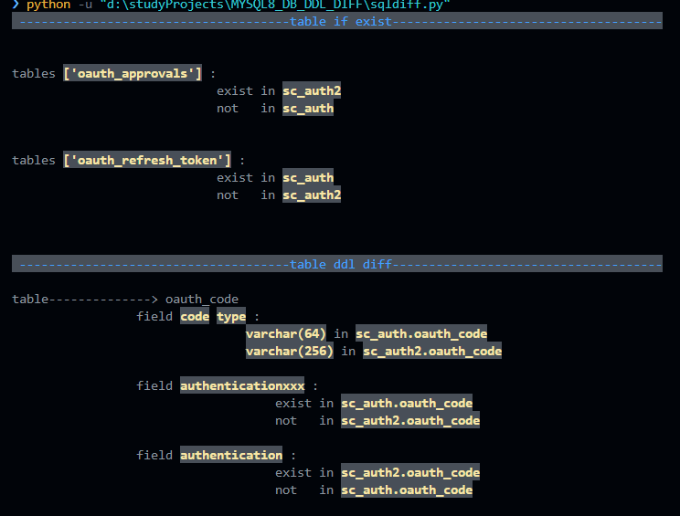

# sql_diff_util
一个实现mysql/postgresql 数据表字段 diff的脚本实现
可用于快速对比测试环境与正式环境数据库ddl差异

# 使用方式
1. 安装pymysql(mysql py驱动)+psycopg2(postgresql py驱动)(如果没有安装的话):
   安装失败的话可以 添加 使用 豆瓣源 ` -i https://pypi.douban.com/simple/ `
    ```pip install pymysql```
    ```pip install psycopg2```
    
    
    
2. 更改main函数中的db地址:
    ```python3
    # mysql diff
    db1 = 'mysql://127.0.0.1:3306/sc_auth?user=root&password=123456'
    db2 = 'mysql://127.0.0.1:3306/sc_auth2?user=root&password=123456'

    # pgsql diff
    # db1 = 'postgresql://127.0.0.1:5432/southgnsspm?user=postgres&password=123456'
    # db2 = 'postgresql://127.0.0.1:5432/southgnss_for_hnjs?user=postgres&password=123456'
    ret = diffDbDDL(db1, db2)

    ```
    
3. 执行应用：
    ``` python -u sqldiff.py```

4. 查看输出:

    

